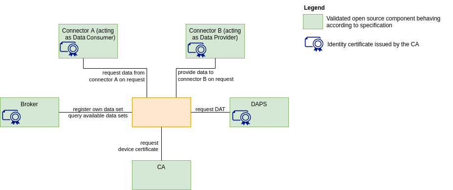

# IDS-testbed

IDS Testbed is a setup with Open Source IDS components which can be used to verify that a component:
- implements the IDS specifications for establishing connections and communication.
- and, thus, can work interoperable with all IDS components in the testbed setup.

## What is it for?

- Component behaviour testing
- Interoperability testing against IDS components (Connector, DAPS, CA, Metadata Broker)
- Preparation for IDS certification
- Starting point for creation of data spaces

:arrow_forward: **This setup can also be used as a MVDS (Minimum Viable Data Space) that is a quickstart to sharing data in a secure and sovereign way.** you can discover more on the [Minimum Viable Data Space page](/minimum-viable-data-space/MVDS.md).

:arrow_down_small: If you would like to use it only for testing purposes, you can continue following the steps below.

## How to get started?

1. Git clone this repository to your local machine and go into the directory (usually ```cd IDS-testbed```) 

2. Make sure you have correctly installed all the [setting up requirements](https://github.com/International-Data-Spaces-Association/IDS-testbed/blob/master/InstallationGuide.md#target-view-preconfigured-testbed). Run ```docker compose up -d``` to start the Testbed and deploy all the components.
   
3. Run the [Postman collection](https://github.com/International-Data-Spaces-Association/IDS-testbed/blob/master/TestbedPreconfiguration.postman_collection.json) to start the tests. There is a guide with the installation and use of Postman which is located [here](https://github.com/International-Data-Spaces-Association/IDS-testbed/blob/master/PreparingPreconfiguredSetup.md#guide-for-preparing-and-validating-the-preconfigured-setup). Current available components for testing are: CA, DAPS, Dataspace connector, Metadata Broker.

4. Test the compatibility of your own developed component following the steps of the [Testbed User Guide](./TestbedUserGuide.md).

5. Download the [Test Suite](https://github.com/International-Data-Spaces-Association/IDS-testbed/tree/master/Testsuite) and follow the instructions to conduct automated tests for your own developed connector

## Current version (V1.0)

Minimal setup with essential and already available components


Used versions of the IDS-testbed components: 
- Certificate Authority (CA)
- Dynamic Attribute Provisioning Service (DAPS) v1.6.0
- Dataspace Connector (DSC) v8.0.2
- MetadataBroker (MDB) v5.0.3

## Implementations of the IDS Testbed

Please include in issue [#104](https://github.com/International-Data-Spaces-Association/IDS-testbed/issues/104) the successful Testbed implementations you have made. Including:
-	Provider (company) name
-	A brief description of the testbed: what are you using it for?
-	Version of IDS-testbed components used (i.e. DSC v7.1.0, MDB v5.0.0, DAPS v1.6.0)
-	Whether it is public or private

| Provider      | Description     |   Components used |  Public or Private Use? |
| ------------- | --------------- |   --------------- | ------------------------
|  Engineering | Verifying TRUEConnector compatibility with reference implementation | DSC v7.1.0, MDB v5.0.0, DAPS v1.6.0 | Private |
|  VTT | IDS-testbed has been utilized for hands-on experience during educational sessions organized by VTT. We have also used the components from IDS-testbed (DAPS, Broker and IDS connector) in VTT Data Space Innovation Lab (DSIL).| MDB v4.2.8, DAPS v1.0.0, DSC v7.0.2 | Private & Public (on demand) |
|  [ATOS](https://atos.net/es/spain) | [How to deploy an IDS-Testbed using Kubernetes](https://github.com/International-Data-Spaces-Association/IDS-Deployment-Scenarios/blob/main/Deployment-Scenarios/minimum-viable-data-space-using-k8s.md) | DSC v8.0.2,  MDB v5.0.3, DAPS v1.6.0 | Public |


## Roadmap
### Version 2.0 of the test bed

Minimum viable data space with all essential components and first test cases


### Version X.Y of the test bed

Integration of all intended components into the setup


### Final vision for the testbed

On the long run, the testbed should be equipped with a test suite and testing components replacing the  open source reference implementations of the components.

