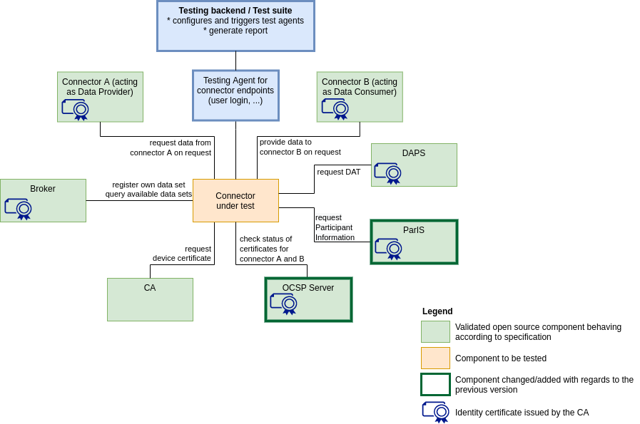

# IDS-testbed

## What is it?

Set up with Open Source IDS components which can be used to verify that a component:​
- implements the IDS specifications for establishing connections and communication.​
- and, thus, can work interoperable with all IDS components in the testbed setup.

## What is it for?

- Component behaviour testing
- Interoperability testing against IDS components (Connector, DAPS, CA, Metadata Broker)
- Preparation for IDS certification
- Starting point for creation of data spaces

## How to get started?

1. Install the reference testbed following the [installation and configuration guide](https://github.com/International-Data-Spaces-Association/IDS-testbed/blob/master/Testbed/README.md) in the Testbed Folder . You can either use the Preconfigured set up or install every component manually. Current available components are: Dataspace connector, DAPS, CA, Metadata Broker.

2. Connect the components to one another following the instructions of the "Interconnectivity of the components", the last section of the [installation and configuration guide](https://github.com/International-Data-Spaces-Association/IDS-testbed/blob/master/Testbed/README.md)

3. Test the compatibility of your own developed component following the steps of the [Testbed User Guide.](https://github.com/International-Data-Spaces-Association/IDS-testbed/blob/master/Testbed/TestbedUserGuide.md)

4. Download the [Test Suite](https://gitlab.cc-asp.fraunhofer.de/ksa/ids-certification-testing) and follow the instructions to conduct automated tests for your own developed connector

## Current version (V1.0)

Minimal setup with essential and already available components

## Roadmap
### Version 2.0 of the test bed

Minimal viable data space with all essential components and first test cases

### Version 2.X of the test bed

Integration of all intended components into the setup

### Final vision for the testbed

On the long run, the testbed should be equipped with a test suite and testing components replacing the  open source reference implementations of the components.

