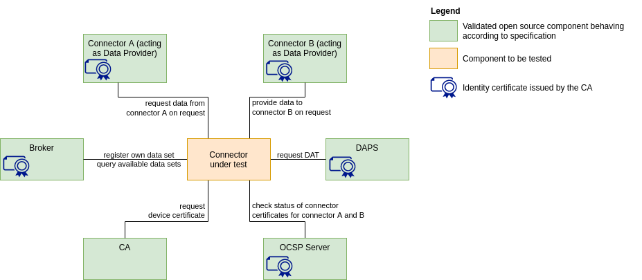

# IDS-testbed

IDS Testbed is a setup with Open Source IDS components which can be used to verify that a component:
- implements the IDS specifications for establishing connections and communication.
- and, thus, can work interoperable with all IDS components in the testbed setup.

## What is it for?

- Component behaviour testing
- Interoperability testing against IDS components (Connector, DAPS, CA, Metadata Broker)
- Preparation for IDS certification
- Starting point for creation of data spaces

:arrow_forward: **This setup can also be used as a MVDS (Minimum Viable Data Space) that is a quickstart to sharing data in a secure and sovereign way.** you can discover more on the [Minimum Viable Data Space page](/minimum-viable-data-space/MVDS.md).

:arrow_down_small: If you would like to use it only for testing purposes, you can continue following the steps below.

## How to get started?

1. Git clone this repository to your local machine and go into the directory (usually ```cd IDS-testbed```) 

2. Make sure you have installed Docker and Docker Compose on your machine. Run ```docker compose up -d``` or ```docker-compose up -d``` to start the Testbed. 
   
3. Run the [Postman collection](https://github.com/International-Data-Spaces-Association/IDS-testbed/blob/master/TestbedPreconfiguration.postman_collection.json) to start the tests. Current available components for testing are: Dataspace connector, DAPS, CA, Metadata Broker.

4. Test the compatibility of your own developed component following the steps of the [Testbed User Guide](./TestbedUserGuide.md).

5. Download the [Test Suite](https://gitlab.cc-asp.fraunhofer.de/ksa/ids-certification-testing) and follow the instructions to conduct automated tests for your own developed connector

## Current version (V1.0)

Minimal setup with essential and already available components


Used versions of the IDS-testbed components: 
- Certificate Authority (CA)
- Dynamic Attribute Provisioning Service (DAPS) v1.6.0
- Dataspace Connector (DSC) v7.1.0
- MetadataBroker (MDB) v4.2.8

## Roadmap
### Version 2.0 of the test bed

Minimum viable data space with all essential components and first test cases


### Version X.Y of the test bed

Integration of all intended components into the setup


### Final vision for the testbed

On the long run, the testbed should be equipped with a test suite and testing components replacing the  open source reference implementations of the components.

