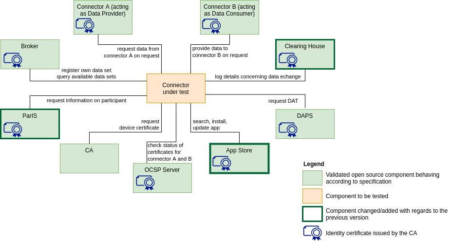

# Versions of Testbed

## First version of the testbed

Minimal viable data space with essential and already available components

## Next version of the testbed

Minimal viable data space with all intended components

## Final vision for the testbed

On the long run, the testbed should be equipped with a test suite and testing components replacing the  open source reference implementations of the components.

