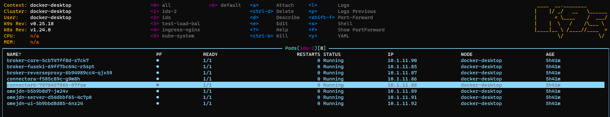

# IDS deployment on Kubernetes 

In this repository are found the instructions to deploy an IDS system with Kubernetes. 

## Requirements

This section summarizes the hardware and software features used for the deployment. Note that the IDS is sensitive to traffic load and may require a more powerful hardware system if traffic increases.

### Software-requirements

- [Kubectl](https://kubernetes.io/es/docs/tasks/tools/) version:
  - Client Version: `v1.24.0`
  - Kustomize Version: `v4.5.4`
  - Server Version: `v1.24.0`
- [Kompose](https://kompose.io/)
  - `1.26.0`

- Cluster runs in [Docker-Desktop](https://docs.docker.com/desktop/windows/install/)
  - `v20.10.14`

-  [IDS-Release 1.0](https://github.com/International-Data-Spaces-Association/IDS-testbed)
-   OS Windows 10 Enterprise
    -   WSL2: Ubuntu 20.04 LTS
  
- OpenSSL `1.1.1f`

### Hardware-requirements
- 16 GB RAM memory
- Intel(R) Core(TM) i5-10310U CPU @ 1.70GHz   2.21 GHz

- 237 GB ROM memory

## Architecture

The following figure shows the proposed architecture. The image and the architecture is based on the next [repo](https://github.com/International-Data-Spaces-Association/IDS-testbed).

## Starting the architecture

- The first step is to created a namespace.
  
  `kubectle create namespace ids-2`
  

- It is necessary to install Nginx driver to be able to make the calls to the cluster from the outside. If the Ingress-Nginx repo is not updated, in this [link](https://kubernetes.github.io/ingress-nginx/deploy/) the official documentation can be found.

    `kubectl apply -f https://raw.githubusercontent.com/kubernetes/ingress-nginx/controller-v1.2.0/deploy/static/provider/cloud/deploy.yaml`

- To comunicate with the nginx-controller is neccesary to add the next lines in `/etc/hosts`.
  
    `127.0.0.1       connectora.localhost`
    
    `127.0.0.1       connectorb.localhost`

- For the ingress manifest is neccesary to create a secret. With the next command it is generate a cert and key file and a secret in the namespace.
  
    `openssl req -x509 -nodes -days 365 -newkey rsa:2048 -keyout tls-key.key -out tls-cert.crt`

    `kubectl create secret tls tls-secret --key tls.key --cert tls.crt -n ids-2`

- The next step would be to launch the application manifests.

    `kubectl apply -f k8s/all -n ids-2`

- The last point would be to check that the deployment has been performed successfully. Using tools such as [K9s](https://k9scli.io/). The results might be as below. 
    

Finally, with a tool such as [Postman](https://www.postman.com/), a test could be performed to verify that the communication and connectivity of the infrastructure are correct. For this purpose, the [ids-certification-testing](TestbedPreconfiguration.postman_collection.json) file is used, in which a set of tests verifies the tool's proper operation on Kubernetes.

[KubeLinter](https://docs.kubelinter.io/#/) have been tested and modified to obtain standarized YAML manifests. Using the next command it is possible to test the manifests.

`kube-linter lint k8s/all --config k8s/Config-test/kube-linter-test.yaml`

These tests can be customized by changing the [file](k8s\Config-tests\kube-linter-test.yaml).

