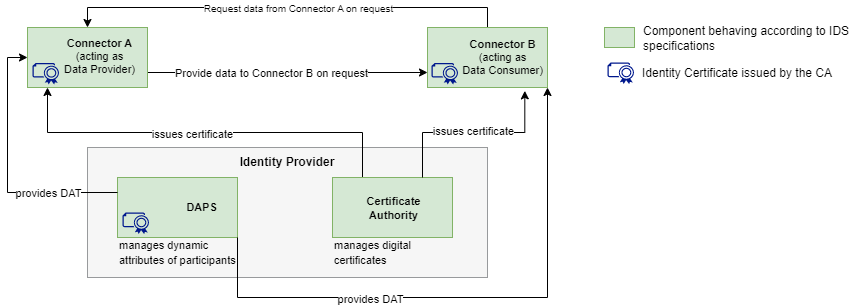

# What is a Minimum Viable Data Space? 
A Minimum Viable Data Space (MVDS) is a combination of components that enable the creation of a data space with just enough features to be usable for secure and sovereign data exchange, as specified by the International Data Spaces Association (IDSA). The goal of an MVDS is to streamline the implementation process, making it easier and faster for experimenters to create a working data space with secure and sovereign data exchange. By starting with an MVDS, the development team can iterate quickly and respond to the requirements of the data space, making adjustments as necessary to meet the needs of users.

It aims to facilitate the work of experimenters by shortening the implementation time (by avoiding lengthy details that would slow down the first release). This allows them to start with a first working version (where secure and sovereign data exchange is granted), where the development team can iterate, identify and respond to the assumptions about the requirements of the data space. 

The MVDS is the unique solution provided by IDSA Head Office, as current best practice.

The [IDS Deployment Scenarios](https://github.com/International-Data-Spaces-Association/IDS-Deployment-Scenarios) act as best practices and sources of inspiration on building data spaces. There, you will find examples of implementation, along with experiments also run with MVDS.

# What are the components required for a MVDS (as specified by IDSA)?
A minimum viable data space consists of: 

1️⃣ Two connectors (one acting as a data provider, and one as a data consumer)

2️⃣ An identity provider (Dynamic Attribute Provisioning Service, Certificate Authority)

3️⃣ Optional and additional components, such as a metadata broker, an app store, a clearing house, or a vocabulary provider, can be added to the MVDS to extend its functionality and enable more advanced features, such as searching for data sets. 

The MVDS provides a starting point for experimenters to create a functional data space that can be customized and expanded as needed to meet specific requirements.

# How can I start implementing a MVDS? 
To implement a Minimum Viable Data Space, you have two alternative paths to follow: 

:one: You can form this MVDS by (re)using and customizing the open-source components listed on [IDS Github](https://github.com/International-Data-Spaces-Association/idsa/blob/main/overview_repositories.md). Some of these solutions are also being used in [IDS Reference Testbed](../README.md). For solutions with a higher maturity level, you can check the ones that are part of [IDS Graduation Scheme](https://github.com/International-Data-Spaces-Association/idsa/blob/main/graduation_scheme/Projects.md).

:two: You can start by developing some or all components from scratch, by following the component specifications listed on [IDS-G](https://github.com/International-Data-Spaces-Association/IDS-G)

🚩 At the final stage of both paths, we highly recommend to use [IDS-testbed](https://github.com/International-Data-Spaces-Association/IDS-testbed) to ensure the compatibility and interoperability of the components you will be using in your MVDS.

And of course, [IDS Certification](https://internationaldataspaces.org/use/certification/) is an essential aspect to ensure the trustworthiness of the implemented minimum viable data space. By following the path of IDS Certification, you can rest assured that all components and operational environments are thoroughly validated, providing an additional trust layer that ensures optimal functionality within clearly specified boundaries. In short, IDS Certification is a great way to secure a trustworthy minimum viable data space.

